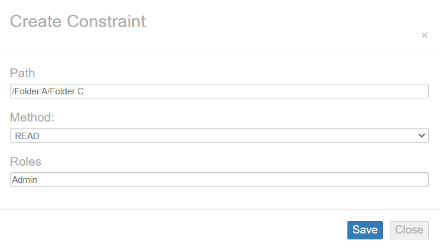

Constraints View
===

The **Constraints** view lets you restrict access through the **Documents** view to specific folders or files by creating constraints. This way, users will be able to access certain resources based on their roles.

    

To create a constraint, you have to specify:

* a path to the folder or file. For example, `/Folder A`
* a method - `READ`, `WRITE`, or both (`*`)
* a role - the role that the user needs to have in order to be able to see or edit the folder/file. For example, `Admin`.

As specified in the screenshot below, only users with the role `Admin` can read `Folder C` that can be accessed by following the path `/Folder A/FolderC`.

The constraints created in the **Constraints** view are also visible in the **Access** view.

!!! info "Related content"

	* [Access View](../access)
    * [Documents View](../documents)