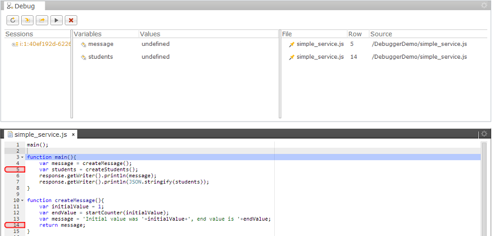
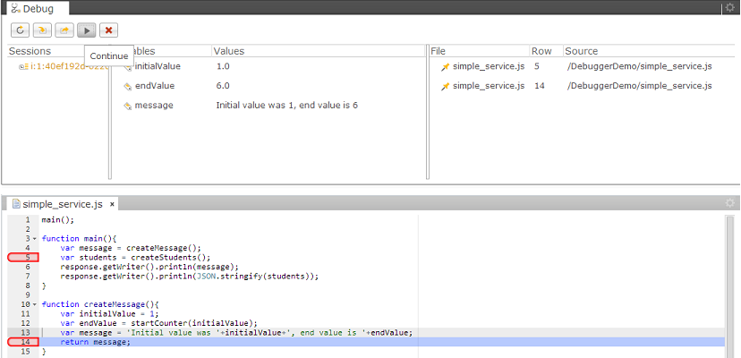
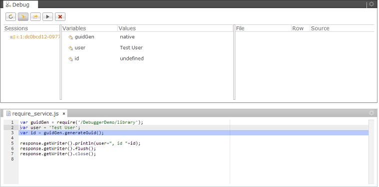

Debug
===

The toolkit offers Debugging functionality. The goal is to easy the developers in the hunt of server side bugs.

Debug Perspective
---

*	*Sessions* - contains all debug execution sessions.
*	*Variables/Values* - contains variables and their values, available in the current scope of execution.
*	*File/Row/Source* - contains inforamation about in witch file and witch row, a *Breakpoint* is set. 

Available Commands
---
*	 Refresh
*	 Step Into
*	 Step Over
*	 Continue
*	 Skip all breakpoints

Debugging Example
---
Step 0 - Project Structure
---

*simple_service.js*
<pre><code>
main();

function main(){
    var message = createMessage();
    var students = createStudents();
    response.getWriter().println(message);
    response.getWriter().println(JSON.stringify(students));
}

function createMessage(){
    var initialValue = 1;
    var endValue = startCounter(initialValue);
	var message = 'Initial value was '+initialValue+', end value is '+endValue;
    return message;
}

function startCounter(value) {
    for(var i = 0; i < 5; i++){
        value ++;
    }
	return value;
}

function createStudents(){
    var students = [];
    students.push(createStudent('Desi', 18));
    students.push(createStudent('Jordan', 21));
    students.push(createStudent('Martin', 22));
    return students;
}

function createStudent(name, age){
    var student = {};
    student.name = name;
    student.age = age;
    return student;
}
</code></pre>

*library_jslib*
<pre><code>
exports.generateGuid = function() {
    var guid = ''+uuid.randomUUID();
    return guid;
};
</code></pre>

*require_service.js*
<pre><code>
var guidGen = require('/DebuggerDemo/library');
var user = 'Test User';
var id = guidGen.generateGuid();

response.getWriter().println(user+", id "+id);
response.getWriter().flush();
response.getWriter().close();
</code></pre>

Step 1 - Open Debug Perspective
---

Click *other...* to list available perspectives

From the list select *Debug* perspective

Now *Debug* perspective is opened

Step 2 - Start Debugging
---

Select *simple_service.js* from *Workspace Explorer*

Debugger was started and waits for user interaction

In the *Debug* view press *Refresh*  button to list available *Debug Sessions* and select one.

Press *Step Into*  button to continue script's execution.

Let's set some *Breakpoints*.
Click on the line numbers on the left of the opened editor.
Press *Refresh*  button to see *Breakpoints* that were set.

Press *Continue*  button to resume script's execution to the next *Breakpoint*.

Press *Continue*  button again.

To exit *Debug Session* press *Skip all breakpoints*  button 
or continue pressing *Step Over*  
or *Step Into*  buttons until script's execution finish.

Step 3 - Debugging Scripts Requiring Libraries
---

Select *require_service.js* from *Workspace Explorer*

A new *Debug Session* was started.
Press *Refresh*  button, select session and 
press *Step Into*  button.

Continue debugging.

