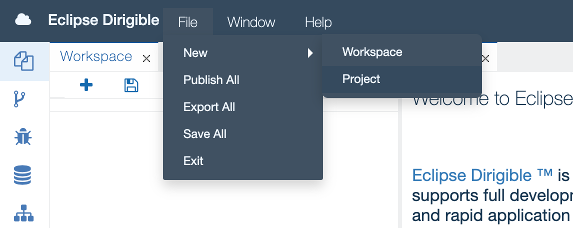
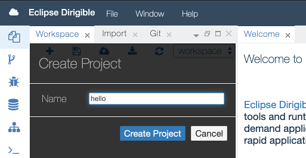
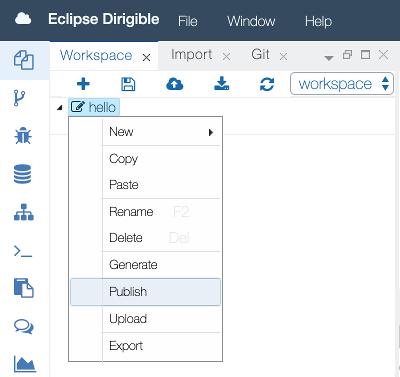

{{ page.title }}
===

### Preamble

This guide explains how to setup an Eclipse Dirigible instance and how to use it to build your very first "hello-world.js" service. The references section below points to the documentation with more technical details for the different aspects of the platform and its components and capabilities.

### Setup

##### Get the binary

* In case you want to use a prebuild package, you can get the one built for your environment from the [downloads](https://download.eclipse.org/dirigible) section.
* To build Eclipse Dirigible from sources by yourself, just follow the instructions in the [README](https://github.com/eclipse/dirigible/blob/master/README.md#build).

##### Choose the environment

* You can choose one of the [options](setup.html) available to get an Eclipse Dirigible instance depending on your target environment.
* A shared trial instance is also available and can be accessed from here: [http://trial.dirigible.io](http://trial.dirigible.io).

There are many [configuration options](setup_environment_variables.html), so you can connect to different databases, use different platforms, choose a specific set of plugins and many more.

##### Access the instance

In case of the standard setup on Apache Tomcat on your local machine you can point your browser to the location:

> http://localhost:8080

### Write the hello-world.js service

1. Once you have a running Eclipse Dirigible instance you can start with your project. Choose the `File -> New -> Project` menu.

    

2. Enter the name of the project and click `Create Project`.

    

3. Use right-click on the project icon in the Workspace Explorer to open the popup menu. Select `New -> Javascript Service`

    

4. Once you enter the name of the service you can open it in the editor with double click on the file icon.
5. It already contains the *hello world* service implementation.

    ```javascript
    var response = require("http/v4/response");

    response.println("Hello World!");
    response.flush();
    response.close();
    ```

6. Now just publish the project by clicking on the `Publish` menu of the project.

    

7. You can check in the `Preview` the result of the execution of our fancy server-side Javascript service, just by selecting the file icon in the Workspace Explorer.

    

### Update the hello-world.js service

1. Go to line 3 in the editor and change:

    > Hello World!

    to

    > Hello Dirigible!

2. The click Ctrl+S (Command+S for Mac) to save the file content.
    
3. You can see that in the `Preview` view the output has changed immediately. This is due to the default configuration of *auto-publish* on *save*.

More about this *dynamic* behavior you can find at the concepts section: [Dynamic Applications](concepts_dynamic_applications.html)

### References

* So far we saw how easy is to create and modify a RESTful service. More samples can be found [here](../samples/index.html). 
* If you would like to know more about how to write more complex services, you can go to the [API](../api/index.html) section. 
* If you are curious what you can do with Eclipse Dirigible apart of writing server-side Javascript services, you can have a look at the [features](features.html) section.
* In case you are interested of modeling and generation features in the Low Code/No Code, you can read about [entity data models](concepts_entity_service.html) and [generation capabilities](concepts_generation.html).

